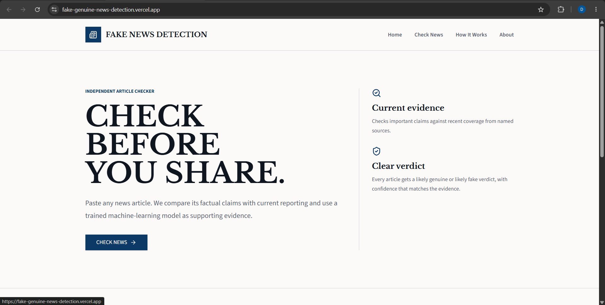
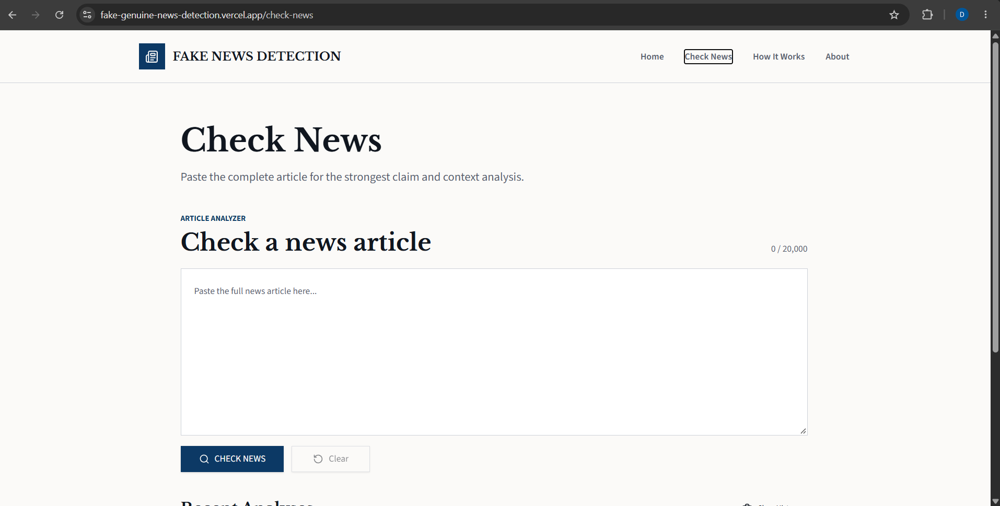
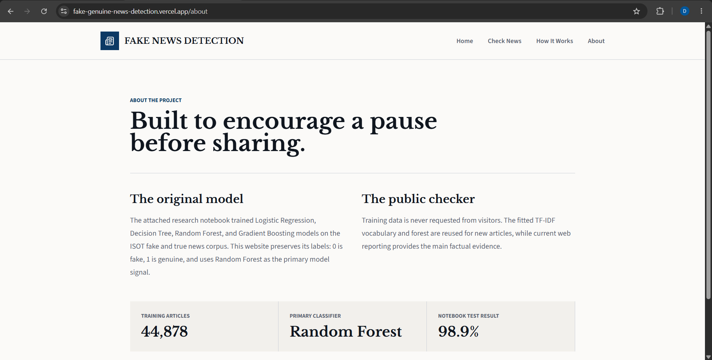

# Fake News Detection — NLP & Machine Learning

An NLP and Machine Learning project that analyzes news articles and classifies them as **Fake** or **Genuine** using TF-IDF and multiple supervised machine learning models.

> NLP-based fake news classification with an interactive application for presenting model predictions and available verification information.

### 🚀 Live Demo

**[Open Fake News Detection](https://fake-genuine-news-detection.vercel.app/)**

### 💻 GitHub

**[View Source Code](https://github.com/dheerajmishra75/fake-genuine-news-detection)**

## 📸 Application Preview

### Home

### Check News

### How It Works

### About

## 🎯 My Technical Focus

My contribution focused primarily on the **data, NLP, and machine learning workflow**.

The main work included:

- Working with labeled Fake/Genuine news data
- Data exploration
- Text preprocessing
- TF-IDF feature extraction
- Feature representation
- Supervised machine learning
- Training multiple classification models
- Model comparison
- Model evaluation

The application interface is used as the presentation layer for the results generated by the machine learning workflow.

## 🧠 Machine Learning Pipeline

The project follows a traditional supervised NLP classification workflow:

    News Dataset
         ↓
    Text Cleaning & Preprocessing
         ↓
    TF-IDF Vectorization
         ↓
    Feature Representation
         ↓
    Machine Learning Models
         ↓
    Model Evaluation
         ↓
    Fake / Genuine Classification

## 📝 Text Preprocessing

News articles are cleaned and prepared before being converted into numerical features for machine learning.

The preprocessing step prepares the text for TF-IDF feature extraction and subsequent model training.

## 🔢 TF-IDF

**Term Frequency-Inverse Document Frequency (TF-IDF)** is used to transform processed news text into numerical feature vectors.

These numerical representations are then provided to the supervised machine learning models.

## 🤖 Machine Learning Models

The project evaluates four supervised learning algorithms:

- Logistic Regression
- Decision Tree
- Random Forest
- Gradient Boosting

## 📈 Model Performance

The evaluated results include:

| Model | Accuracy |
| --- | ---: |
| Logistic Regression | 98.57% |
| Random Forest | 98.90% |

These accuracy values represent performance on the evaluated dataset used during model development.

They should not be interpreted as guaranteed real-world accuracy for every future news article.

## 🔄 Classification Workflow

    News Article
         ↓
    Input Validation
         ↓
    NLP Preprocessing
         ↓
    TF-IDF Transformation
         ↓
    ML Classification
         ↓
    Fake / Genuine Result
         ↓
    Available Evidence / Verification Information

## 📊 Dataset

The machine learning workflow uses labeled news data containing Fake and Genuine news examples.

The dataset is used for:

- Data exploration
- Text preprocessing
- Feature extraction
- Model training
- Model evaluation

User-submitted articles are processed through the learned classification pipeline rather than being treated as simple dataset lookups.

## 📚 Application Pages

- **Home** — Introduction to the application and its purpose.
- **Check News** — Submit a news article and analyze it.
- **How It Works** — Explains the machine learning and analysis workflow.
- **About** — Project and application information.

## 🛠️ Technical Skills

- Python
- Scikit-learn
- Natural Language Processing
- TF-IDF
- Machine Learning
- Text Classification
- Supervised Learning
- Model Evaluation
- Feature Engineering

## 📌 Project Approach

The project focuses on taking raw textual news data through a complete machine learning workflow:

    Data
     ↓
    Preprocessing
     ↓
    Feature Engineering
     ↓
    Model Training
     ↓
    Model Comparison
     ↓
    Evaluation
     ↓
    Classification

The main technical focus is the **NLP and machine learning layer**, while the application interface provides a way to interact with and present the resulting predictions.

## ⚠️ Limitations

- The model provides a machine-learning classification, not absolute proof that a real-world claim is true or false.
- Model performance depends on the quality and distribution of the training data.
- News topics, writing styles, and misinformation techniques can change over time.
- Evidence and verification information may depend on available external sources.
- Dataset accuracy does not guarantee identical performance on every future news article.

## 🚀 Future Improvements

- Real-time source verification
- Automated claim extraction
- External fact-checking API integration
- Source credibility analysis
- Explainable AI predictions
- Multilingual news classification
- Transformer-based NLP models
- Continuous model evaluation
- Improved detection of emerging misinformation patterns

## 🔗 Project Links

**GitHub:**  
https://github.com/dheerajmishra75/fake-genuine-news-detection

**Live Demo:**  
https://fake-genuine-news-detection.vercel.app/

## 👨‍💻 Contribution

My primary contribution focused on the **dataset and machine learning workflow**, including data preparation, NLP preprocessing, TF-IDF feature extraction, supervised model training, model comparison, and evaluation.

The application interface presents the results of the underlying machine learning workflow.

## 🚀 Local Development

    git clone https://github.com/dheerajmishra75/fake-genuine-news-detection.git
    cd fake-genuine-news-detection
    npm install
    npm run dev

Environment-specific configuration should be provided through environment variables.

## 👤 Author

**Dheeraj Mishra**

B.Tech Computer Science & Engineering

Interested in Data Science, Machine Learning, Artificial Intelligence, Natural Language Processing, and Data Analytics.

**GitHub:**  
https://github.com/dheerajmishra75

**Live Demo:**  
https://fake-genuine-news-detection.vercel.app/

## ⚠️ Disclaimer

This application provides machine-learning-based predictions and should not be considered an authoritative fact-checking system. Important claims should be independently verified using reliable primary sources, established news organizations, and independent fact-checking resources.
